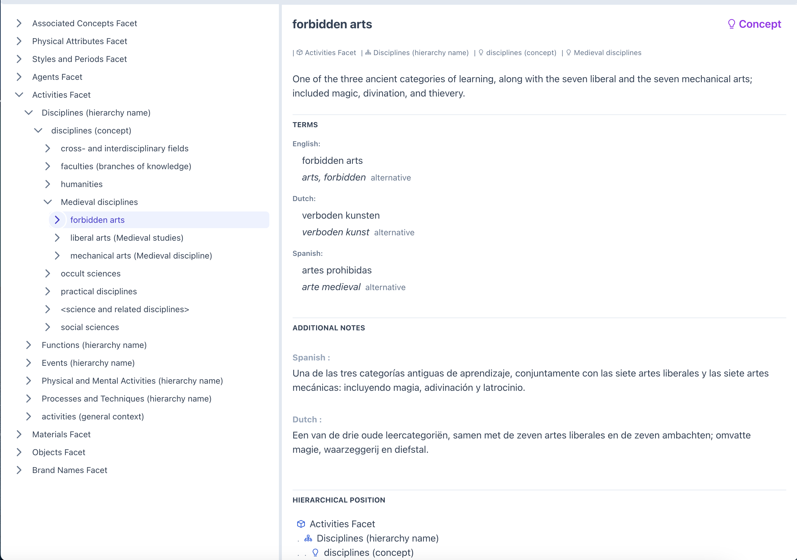

# GVET - Getty Vocabulary Explorer Tool

A demonstration of using the Getty Vocabularies SPARQL endpoint as a datasource for a web applcation.



## Features

### Completed
- A researcher is uniquely identified and authenticated by the system in order to offer a personal experience
- A researcher can browse the Art & Architecture Thesaurus hierarchy in order to get to aid in information discovery
- A researcher can view subject details including the preferred label, note, terms, and location in the hierarchy

### Planned

I had orignally planned to implement the following features, however I ended up investing time in reading
the extensive documentation around the Getty Vocabularies in the gvp-lod.pdf. Additionally, I have never
used SPARQL before and only had a basic understanding of RDF before starting this project. It took me some time to learn the SPARQL syntax and understand the RDF store.
I enjoyed the opportunity to learn a few new skills on this simple project.  


- A research can do a full-text search against the ATT 
- A researcher can create their own lists of 'subjects' for easy recall later
- A researcher can view their search history
- A researcher can add personal notes to a Subject

## Constraints

  - limit to eight hours of development time
  - include a front end component to the demonstration
  - use the Vue.js framework for the front-end of the application (based on job posting) 
  - use the flask framework as the backend (based on job posting)
  - use the getty vocabulary API (either REST or SPARQL)

## Other Requirements

- Design the solution so that modules are easily testable in isolation
- Implement good UI practices, minimalistic user interface and accuratley display the system state (loading new data for example) 
- Full Text Search requires preprocessing on the users input
  - remove punctuation
  - remove STOP words
  - add wildcards
  - add conjunctions

## Decisions

- Should the front end call the getty vocabulary API directly or should it only interact with the flask backend
  - decided that the front-end should be required to only interact with the backend created for this project
  - the backend created for this project provides a good abstraction for the front end and adds additional capabilities not available in the getty API, authentication for one.
  - additionally, I wanted to demonstrate my full stack skills for this projecty

- Use a front end component and UI library on top of vue, or roll my own
  - due to time constraints and in the interest of learning something new, I chose to use the PrimeVue component library
  - I haven't used this library before, but was able to build a quick prototype fairly painlessly
  - PrimeVue is minimalistic, easy to theme, and contained the types of components I thought I would need
  - Used tailwind.css as a utility css library, mainly to speed up construction

- Should SPARQL queries be "inline" with the python code or in there own file
  - I decided to create a query_templates folder and store the sparql queries there
  - Some queries require a subject_ID or other parameter to be inserted as part of the query. I used the python string.template library to convert a template to a query and I configured it to use a custom delimeter to mark variables because the SPARQL language uses a lot of {}.

- Seperate logic from the web framework
  - in the back-end code, i created a package called 'gv' (for getty vocabularies)
  - i isolated from the web framework to make testing and development easier

- Responsibilities - a brief description of decisions I made in designing the application
  - front-end Vue.js application 
    - concerned with providing a good user experience for the user and contains no logic about how to query the getty APIs
    - contains logic for displaying information, such as grouping Terms by language
  
  - GVET Backend
    - gv package: 
      - QueryService: issues http requests to the Getty SPARQL endpoint and does basic parsing on the response
      - VocabulariesService: is concerned with the 'domain' logic
        - it takes simple python dictionary information from the QueryService and parses it into a well defined typed set of dataclasses
        - it constructs and returns a graph of objects in a form that is useful to the front end (but not web specific)
    - REST Endpoints:
      - adds URL links to the graph returned by the gv.VocabulariesService, making it easy for the front end logic to request additional information
      - converts the domain objects into JSON 
      - accepts and validates requests from the front-end, and calls the gv.VocabularyService to fulfill the request


## Project Layout


### client : front-end Vue.js single page application project
- Views
  - There is a single view "Explorer" in the views folder. The plan is to eventually use vue-router but at this point the application is still simple enought to not require it

- UI Components:
    - the application UI is divided into two main components, an explorer tree view and a subject details panel
    - The subject details panel is further broken out into several smaller components to make the logic easier to read and for code-reuse

- Development Tools
  - Vite is configured in the client folder with a dummy index.html file to make component development and testing easier
  - For production, Vite is configured to package up all the front-end code and deliver it to the Flask static folder
  - using Just:
    - to start the front end client for development work use. ```just start-client```
    - to build the front end code and deliver to the static folder use ```just build```

### Server : flask application, domain models, and utility functions

  - The backend code is located under the gvet folder and includes
    - a flask application
    - two flask blueprints: auth for authentication and rest-api to provide an api for the front end
    - gv package: connects to the getty SPARQL endpoint, issues queries, shapes data to fit the problem domain and passes results on to the flask rest endponts. 
    - the authentication system uses a sqlite database which is automatically created when you start the app
  - Development Tools:
    - using Just:
      - to start the flask application in development mode. ```just start```
      - to run unit tests. ```just test```
      - to run integration tests. ```just full-test```
